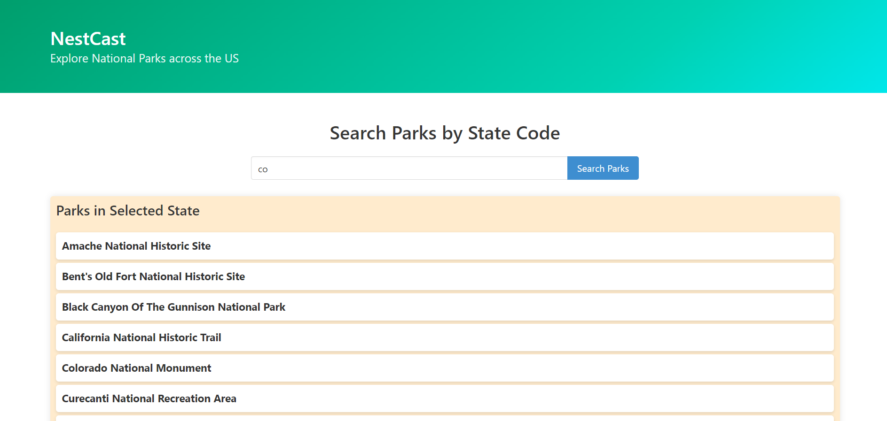

# Nest-Cast
Combines comprehensive park information with real-time weather updates, providing you with everything you need to plan the perfect day outdoors. Whether you're a seasoned hiker, a family looking for a picnic spot, or simply seeking a serene place to unwind, our website has you covered.

## User Story
As a Hiker
I WANT to be know the weather conditions of a Park
SO THAT I can plan for a trip in the future
I WANT to be presented with a search page for states
SO THAT I can find national parks in my area
I WANT to select a park and be presented with weather info for that area
SO THAT I can be prepared for my trip
I WANT images of the park that I am searching
SO THAT I know what the area looks like

## Resources

Xpert Learning Assistant. (accessed 2024, April 8th-16th) https://bootcampspot.instructure.com/courses/5271/external_tools/313

Bulma. (accessed 2024, April 8th-16th) https://bulma.io/

Openweather. (2012-2024) Openweather API. https://openweathermap.org/

National Park Service. (accessed 2024, April 8th-16th) https://www.nps.gov/subjects/digital/nps-data-api.htm

## Deployed Site

https://mpredelus3.github.io/nest-cast/

